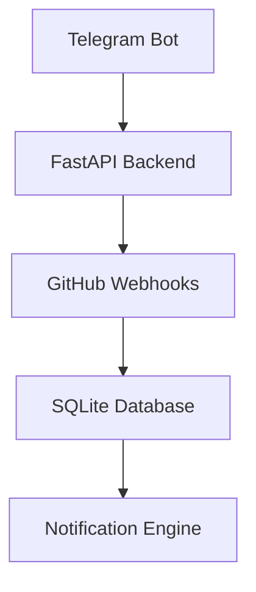

<div align="center">

# ⚡ GitGram

### Manage GitHub From Telegram


<br>


<br><br>


</div>

---

# 📡 What is GitGram?

GitGram is a Telegram-powered GitHub assistant that allows developers to:

- 🚨 Receive real-time repository alerts
- 🧠 Monitor issues & pull requests
- ⚡ Manage repositories directly from Telegram
- 🔐 Authenticate securely with GitHub PAT
- 📲 Reduce context switching during development

---

# ⚙️ Live Workflow

```bash
$ python main.py

✓ FastAPI server started on port 8000
✓ Telegram bot initialized
◎ Waiting for GitHub webhook events...

📦 Incoming issue event
🚨 Issue #42 opened — "Login page crashing"
📨 Telegram notification sent → @sarwar_dev

$ /close 42
✓ Issue #42 closed successfully
````

---

# ✨ Features

<table>
<tr>
<td width="50%">

## 📡 Repository Monitoring

* Issue notifications
* PR alerts
* Commit tracking
* CI/CD events
* Deployment notifications

</td>

<td width="50%">

## ⚡ Telegram Actions

* Close issues
* Reopen issues
* Comment on issues
* Merge PRs *(planned)*
* Repository status checks

</td>
</tr>

<tr>
<td width="50%">

## 🔐 Security

* PAT authentication
* Webhook signature verification
* Multi-user architecture
* Environment variable protection

</td>

<td width="50%">

## 🧠 Smart Workflow

* Mobile-first development
* Zero browser switching
* Instant push notifications
* AI summaries *(planned)*

</td>
</tr>
</table>

---

# 🏗️ Architecture



---

# 🛠️ Tech Stack

| Layer              | Technology                |
| ------------------ | ------------------------- |
| Backend            | FastAPI                   |
| Language           | Python                    |
| Telegram           | python-telegram-bot       |
| Database           | SQLite                    |
| GitHub Integration | GitHub REST API           |
| Webhooks           | GitHub Events             |
| Deployment         | Render / Railway / Docker |

---

# 📦 Installation

## 1️⃣ Clone Repository

```bash
git clone https://github.com/your-username/thegitgram_bot.git
cd thegitgram_bot
```

## 2️⃣ Create Virtual Environment

```bash
python3 -m venv venv
source venv/bin/activate
```

## 3️⃣ Install Dependencies

```bash
pip install -r requirements.txt
```

## 4️⃣ Configure Environment

Create `.env`

```env
TELEGRAM_BOT_TOKEN=your_token
GITHUB_WEBHOOK_SECRET=your_secret
DATABASE_URL=sqlite:///gitgram.db
NGROK_AUTH_TOKEN=your_ngrok_token
```

## 5️⃣ Run

```bash
python main.py
```

---

# 🤖 Telegram Commands

| Command         | Description         |
| --------------- | ------------------- |
| `/start`        | Initialize bot      |
| `/connect`      | Link GitHub account |
| `/status`       | Repository status   |
| `/close <id>`   | Close issue         |
| `/comment <id>` | Comment on issue    |
| `/repos`        | List repositories   |

---

# 🔒 Security Notes

* Never store PATs in plain text
* Encrypt tokens before database storage
* Verify GitHub webhook signatures
* Use GitHub Apps in production
* Enable endpoint rate limiting

---

# 🛣️ Roadmap

* [x] Real-time issue notifications
* [x] Telegram issue management
* [x] Multi-user support
* [ ] GitHub OAuth login
* [ ] Merge PRs from Telegram
* [ ] Inline action buttons
* [ ] AI-generated summaries
* [ ] CI/CD notifications
* [ ] Multi-repository dashboards

---

# 🌌 Vision

> GitGram aims to become the Telegram-powered operating system for developers — from issue management to deployments, forming a complete DevOps communication layer.

---

<div align="center">

## ⭐ Support the Project

If you like GitGram, give it a star ⭐


</div>
```
